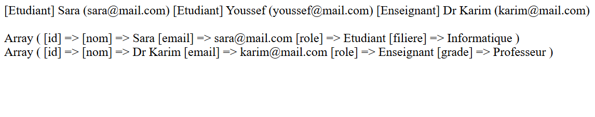

# LAB 3 — Héritage, Classes Abstraites et Interfaces

## 📚 Cours
Ingénierie Logicielle Web avec PHP 7 : Architecture Multicouche et Accès aux Données Sécurisé

---

## 🎯 Objectifs pédagogiques


À la fin de ce laboratoire, il devient possible de :

- comprendre et utiliser l’héritage (extends) pour factoriser le code ;
- créer une classe abstraite (abstract) avec des méthodes abstraites ;
- définir et implémenter des interfaces (contrats) ;
- pratiquer le polymorphisme (manipuler des objets différents via un type commun) ;
- organiser proprement le code avec namespaces et autoload (structure PSR-4 simple) ;
- tester un scénario complet en CLI sans framework.

---

## ⚙️ Prérequis techniques

- Avoir terminé le LAB 2 (autoload fonctionnel, namespaces, entités).
- PHP 7.x installé.
- Savoir lancer : php public/index.php.

---

## 💻 Environnement requis

Structure de projet (à compléter) :
```
PhpProject3/
  public/
    index.php
  src/
    Entity/
    Contract/
    Service/
```
---

## ▶️ Exemple d'exécution




